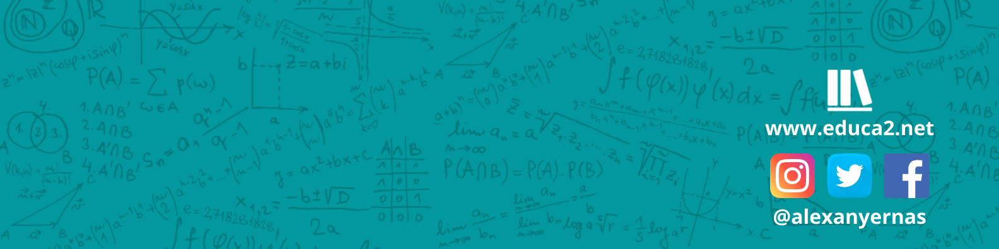

# ¡Hola, soy Alexanyer Naranjo! 👋
#### Desarrollador Full Stack

---

## Un poco sobre mí 💭

Estudiante de Ciencias de la Computación en la Facultad de Ciencias de la Universidad Central de Venezuela, donde he tenido la oportunidad de ser preparador de múltiples asignaturas tales como Algoritmos y Estructuras de Datos, y actualmente, Probabilidad y Estadística.

Me desenvuelvo como Desarrollador Full Stack con experiencia manejando diversas tecnologías, de las cuales destaco mi trabajo utilizando Laravel como framework Backend de PHP y React como librería Frontend de JavaScript. Entre otras herramientas, manejo C/C++, Java, Python, Git y WordPress.

Por último, siempre he tenido una fascinación por la enseñanza y el aprendizaje, por ello desde el año 2019 junto con Alejandra Giannattasio, iniciamos el proyecto Educa2 donde buscamos brindar la importancia de la programación en el día de las personas a través de cursos, clases, talleres y charlas. 

---

## Tecnologías 👨🏻‍💻

 
 

## Habilidades 🙌 

- Resolución de problemas
- Capacidad de análisis
- Motivación al aprendizaje continuo
- Comunicación
- Trabajo en equipo
- Manejo de tecnologías sobre programación web

---
## Portafolio de trabajo 💡

 - [Portafolio][portafolio] 
---

## Contacto 📬

- [Twitter][tw]
- [Instagram][ig]
- [LinkedIn][lk]
- [WhatsApp][wp]

<!-- ENLACES -->
[tw]: https://twitter.com/alexanyernas/
[ig]: https://instagram.com/alexanyernas/
[lk]: https://linkedin.com/in/alexanyernas/
[wp]: https://wa.me/584120283147/
[portafolio]: https://alexanyernas.github.io/My-Portfolio/

